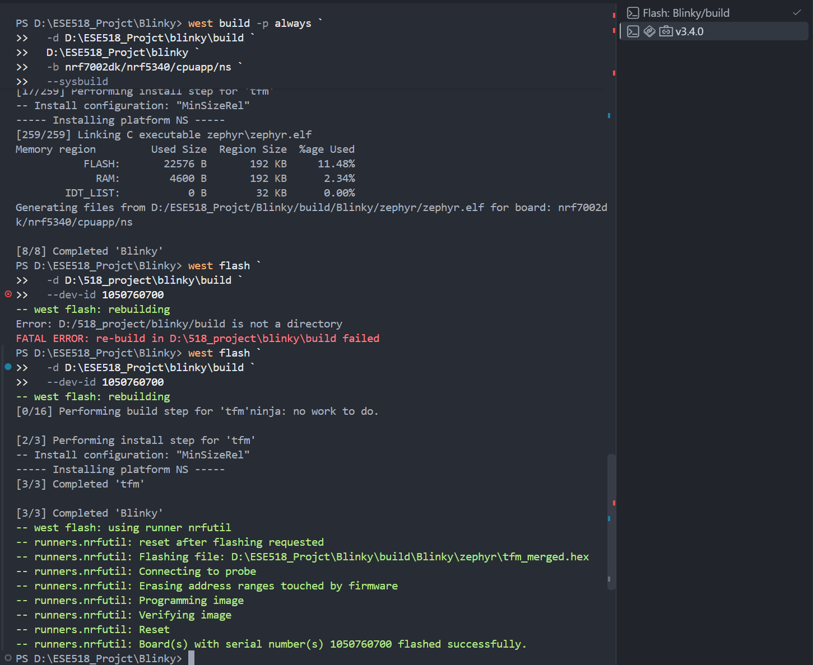
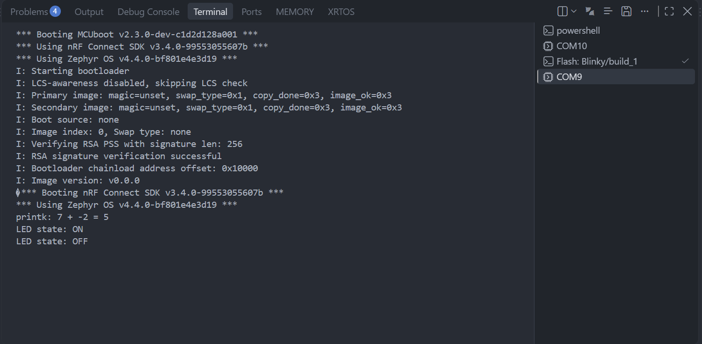
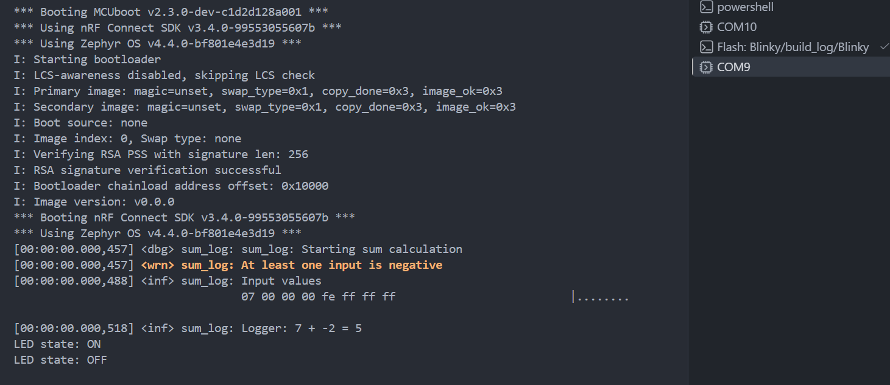
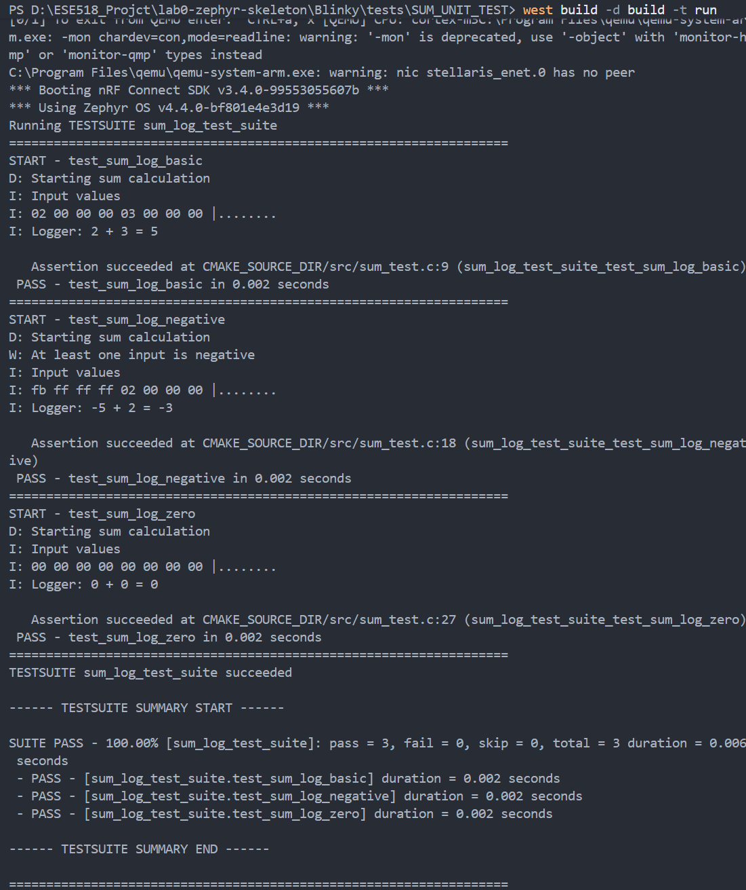
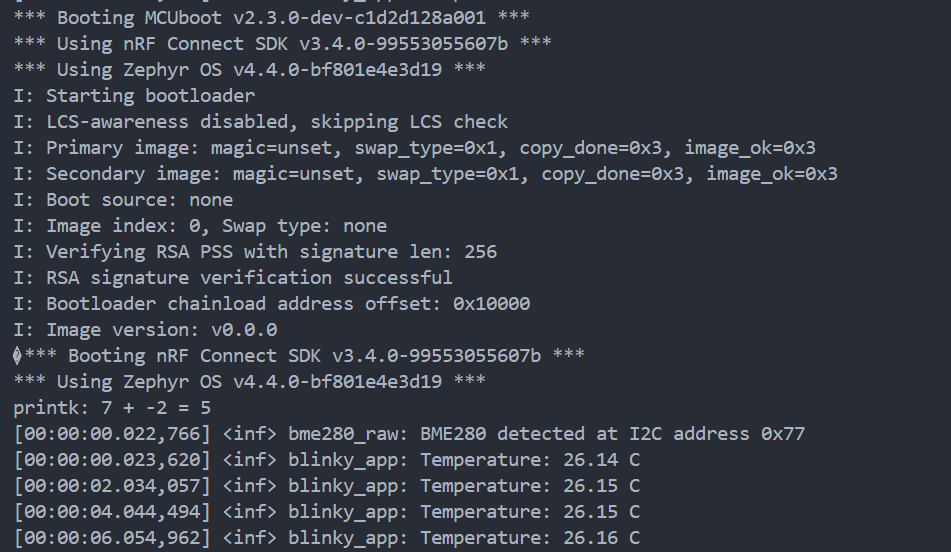
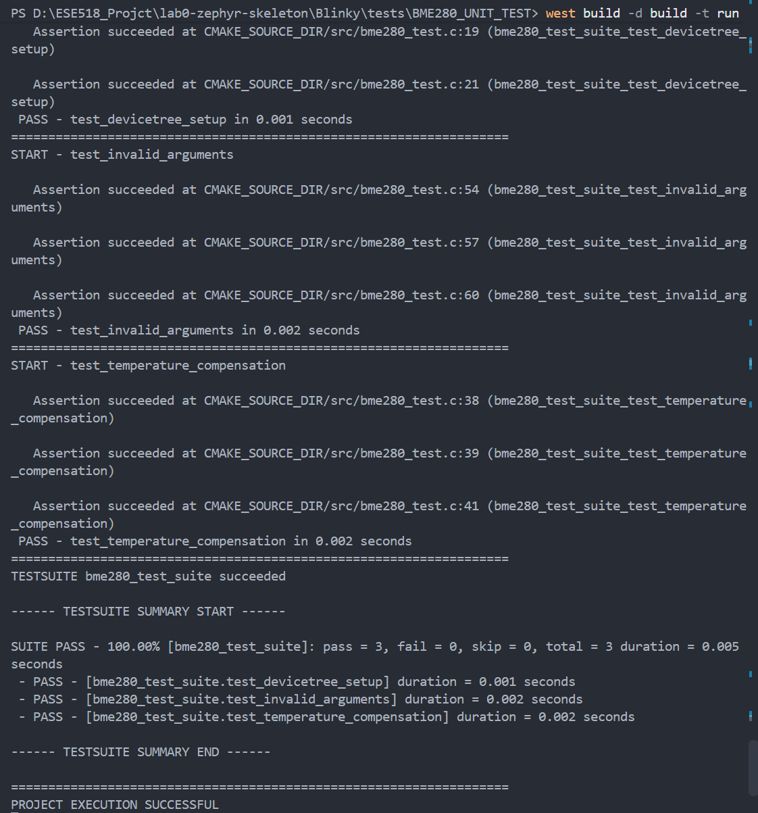

# ESE5180: Lab 0 Zephyr

| Team Member Name | Email Address          |
| ---------------- | ---------------------- |
| Zicong Zhang     | zhang89@seas.upenn.edu |

**GitHub Repository URL: [github.com/zhang89-spec/ESE5180-lab0](https://github.com/zhang89-spec/ESE5180-lab0)**

## 3. Building with West

### 3.1 **terminal prints**

## 6. Printing vs. Logging

### 6.1 Console output of printk

### 6.2 Console output of log

## 7. Ztest for Unit Testing

### 7.1 testing outputs

## 8. Adding a Peripheral (BME280)

### 8.1 Temperature output

### 8.2 Ztest Output

